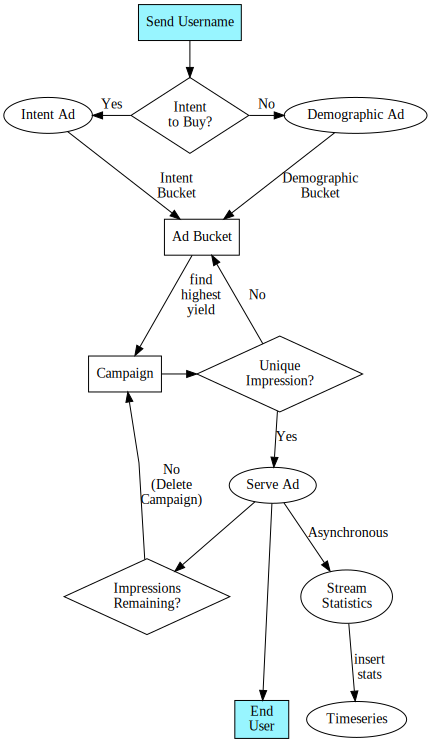

## Using Redis Gears to Increase Advertising Revenue

### Top-Level Problem Statement

```
Find me the highest yielding ad that has not already been seen by the end user
in the shortest time possible and store the impression telemetry data for display later.
```

### Top-Level Solution

Redis Gears allows for all of the ad serving logic to live on the server side.

This data locality ensures that all information is retrieved in the fastest possible manner.

To ensure unique impressions, Redis Bloom makes it possible to keep track of wether a user has seen an ad before with minimal latency and low memory usage.

Finally, Redis Timeseries can efficiently and quickly store impression timeseries data and easily integrate with Redis Streams.


### Modules Used

| Module | Usage | Notes |
|--|--|--|
| [RedisGears](https://redisgears.io)| Run all of the Ad serving logic | [Python script](../adgear.py) |
| [RedisBloom](https://redisbloom.io)| Check for unique impressions by Campaign and user ID | Client returns 1 if user ID already present |
| [RedisTimeseries](https://redistimeseries.io)| Storing Revenue and Impression data | Use SUM type for this example |


### Datastructures

| Usage | Data Structure | Notes |
|--|--|--|
| Bucket Data | [Sorted Set](https://redis.io/commands#sorted_set) | Use [ZREVRANGE](https://redis.io/commands/zrevrange) to find the highest scored (yielding) campaign within a bucket |
| Intent to Buy | [String](https://redis.io/commands#string) | Set a TTL on Intent to Buy so this will expire after a given time |
| User Data | [Hash](https://redis.io/commands#hash) | Containers user's demographic data |
| Ad Data | [String](https://redis.io/commands#string) | The gear decrements the count every time an Ad is served |
| Telemetry | [Streams](https://redis.io/topics/streams-intro) | Asynchronously send the telemetry data to be processed into the Timeseries Database for display later |

### Ad Serving Concerns Excluded from this Demo

#### Affinity

It is assumed that we are serving only ads for a single site and do not need to worry about an ad's affinity for certain types of sites such as sites that discuss Alcohol or Tobacco products.

#### Blacklist

Since there is no chance that an ad will be shown for a rival or on another ad network due to showing an example for a single site, blacklisting features were excluded

#### Time Periods

Because this demo may be run at any time of day, time of day windowing features were excluded for ease of demonstration.

#### Client Information

Information on client (eg IP address, browser fingerpriting) were excluded for ease of demonstration on all platforms.

#### Pacing

While pacing is certainly an important part of Ad campaigns, it was exculded from this demonstration.  Pacing is also called "Rage Limiting" and Redislabs has a separate [webinar on this topic](https://www.youtube.com/watch?v=CRGPbCbRTHA)

### Flowchart



